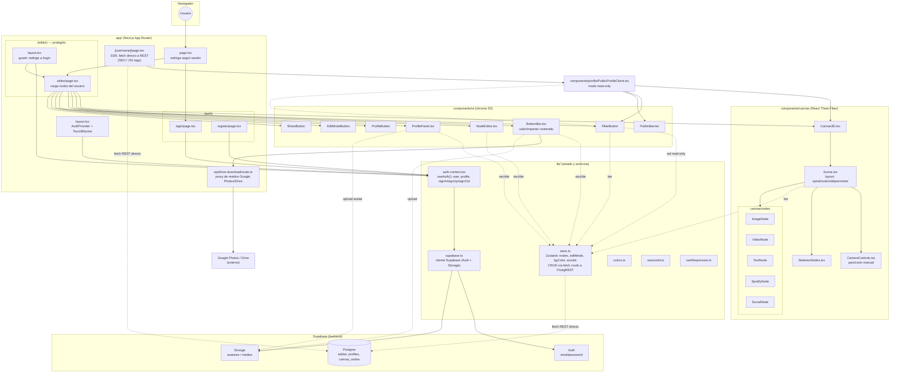

# Arquitectura de Feed.Me

Diagrama generado a partir del código real del repo (Next.js 14 App Router + React Three Fiber + Supabase). Ábrelo en VSCode con una extensión de preview Markdown+Mermaid, o en GitHub (renderiza Mermaid nativamente).

## Notas clave

- **Todo el CRUD de datos** (`canvas_nodes`, `profiles`) pasa por `fetch` crudo a la API REST de Supabase (PostgREST) en `lib/store.ts`, **no** por el cliente JS `@supabase/supabase-js` — según comentarios en el código, ese cliente "se cuelga" en escrituras. El cliente JS (`lib/supabase.ts`) se usa solo para Auth y Storage.
- **Único endpoint API propio**: `app/api/drive-download/route.ts`, que actúa de proxy para importar imágenes/videos desde links de Google Photos/Drive.
- **Sin carpeta `supabase/`**: el esquema de la base de datos no está versionado en el repo, solo se infiere del código (tablas `profiles` y `canvas_nodes`).
- **Capa 3D**: React Three Fiber + drei + react-spring/three, con cámara y controles de pan/zoom implementados a mano (sin `OrbitControls` de drei).
- **Vista pública** (`/[username]`) es server component con fetch directo (para SEO/OG tags) que delega el canvas 3D a un client component (`PublicProfileClient`) en modo solo-lectura.
